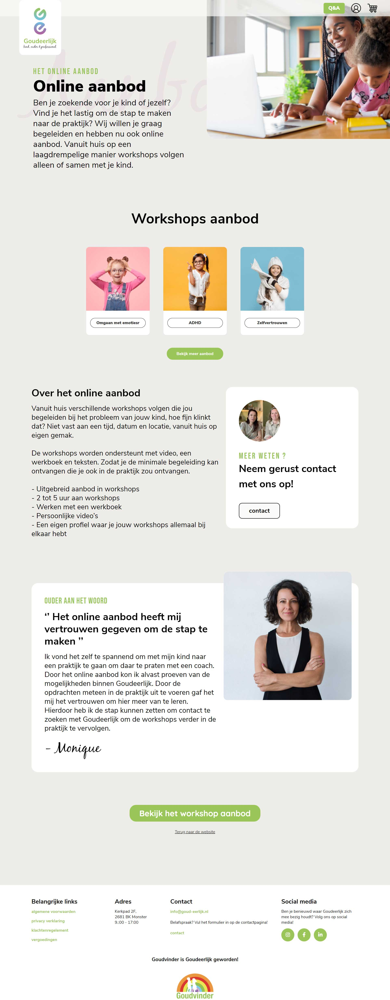

### `Divine Danish Workshop for Kids -` [Live Link](https://iftikharrasha.github.io/divine-workshop-danish/).

<p align="center">
  <a href="https://iftikharrasha.github.io/divine-workshop-danish/">
    
  </a>
</p>
<h1 align="center">
  Divine - Alunno
</h1>
<p align="center">
  Design and prototyping using Adobe XD and built using HTML - CSS - bootstrap, Hosted on Github pages.
</p>



## 🚀 Installation

1.  Clone the repository and change directories

    ```shell
    git clone https://github.com/iftikharrasha/divine-workshop-danish.git
    cd divine-workshop-danish
    ```

2. Click index.html or Start the local server

    The site is now running at `http://localhost:3000`!
    

3.  **Open the source code and start editing!**
 
 ## 🎨 Color Reference
| Color          | Hex                                                                |
| -------------- | ------------------------------------------------------------------ |
| Black          |  `#000000` |
| Primary        |  `#9BC65A` |
| Accent        |  `#E9E2E3` |
| Secondary        |  `#D6B3C8` |
| White          |  `#ffffff` |


